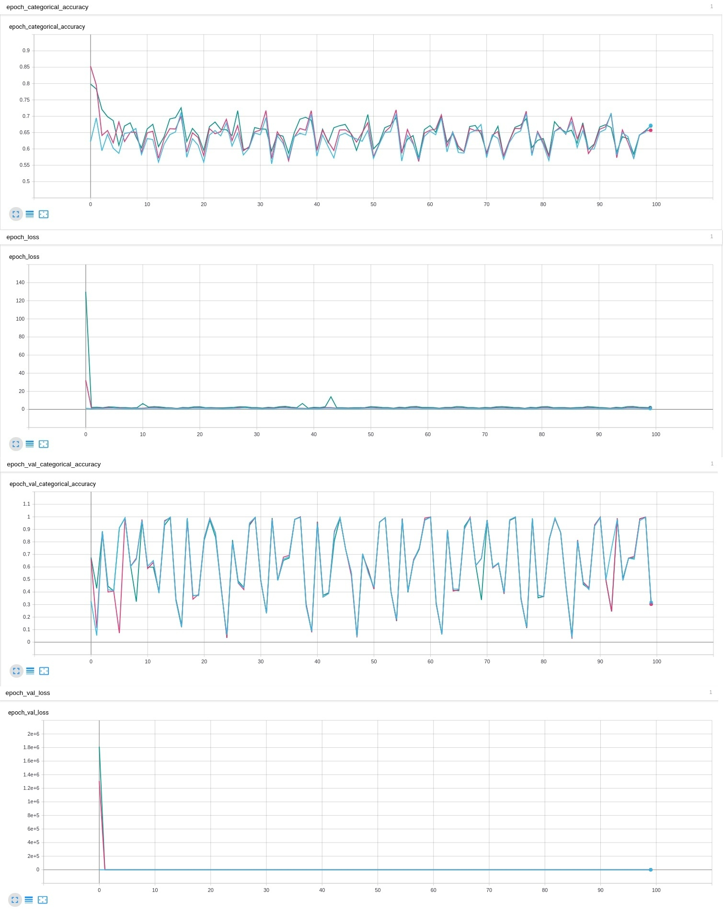

# Lab_3
### Первый блок - 2а
Learning rate(скорость обучения) :
Оранжевый - 0.001;
Синий - 0.55
Темнокрасный - 0.256

На обучающей выборке синий сходится быстрее всех,не имеет выбросом по точности после схождения. В тоже время синий близок к схождению, но не сходится. Красный  крайне далек от схождения. Точность на валидационной показывает, синий и темнокрасный имеют значительно большие пики нежели оранжевый.Ошибки на валидационной выборке оранжевый не показывает, когда красный имеет огромный пик

Вывод:
Оптимальный вариант со скоростью обучения 0.001

### Второй блок - 3с
Learning rate(скорость обучения) :
Голубой -0.114
Розовый - 0.171
Зеленый - 0.276

Ни один из цветов на обучайщей выборке не сходится. Все цвета имеют огромный разброс на валидационной выборке. На грфиках потерь самый большой пик имеет зеленый график, за ним  розовый , а потом голубой

Вывод:Оптимального варинта нет, так как ни один не сошёлся

### Третий блок - 3d
Learning rate(скорость обучения) :
Серый - 0.154
Оранжевый - 0.232
Синий - 0.086
На обучающей выборке синий сходится быстрее всех. Разброс точности на валидационной выборке у всех графиков приблизительно равен. У синего графика скачки самый низкие, также он имеет меньшую ошибку

Вывод:
Оптимальный вариант со скоростью обучения 0.154

### Четвертый блок - 3e
Learning rate(скорость обучения) :
Темнокрасный - 0.154
Голубой- 0.232
Розовый - 0.086

На обучающей выборке по величине выборосов графики ведут себя одинаково, однако заметно, что голубой график вообще выбросов не имеет. На валидационной выборке, графики ведут себя практически идентично. Также голубой график не имеет выбросов на графике точности

Вывод оптимальный вариант со скоростью обучения 0.232

